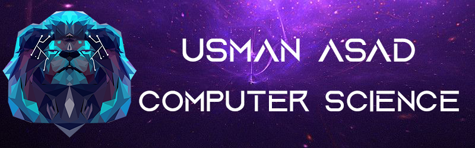

## Hey there! 

My name is Usman Asad and I am a Canadian Computer Science student at McMaster University. I am currently in the last year of my undergrad and I've loved every moment of it! I love learning all about technology and engineering. Just seeing our civilization improve year to year with modern-day engineering makes me excited to see what the future holds for us. I really wish to contribute to that future in someway or another with my work. Another thing that I am passionate about is cars/automobiles and one day I hope that I can leverage my software engineering knowledge and use that to work at such a company. I am experienced with OOP, cloud architecture, algorithms, and database design/modeling. 

### 💬 Ask me about
* Projects that I have worked on
* Student Life at McMaster University 📚 
* Anything about cars! 🏎️ 
* My thoughts on new tech 💻
* Computer Science

If you have any questions or would like to speak to me, don't hesitate to contact me!

### 📫 You can reach me at 

